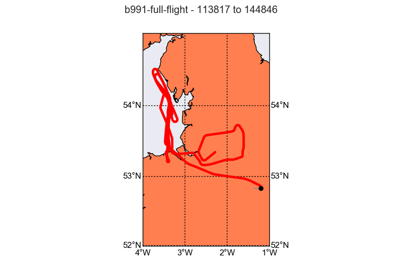

Recipe - Post Flight Analysis
=============================

This is an example for what the post flight analysis for a typical FAAM chemistry flight could look like.

The data we are using are from the "Into the Blue" flight b991 on the 24th October 2016. This flight took us up and down the west coast between Morecambe and Wales. On that stretch some "plumes" were sampled, that originated from the Manchester/Liverpool area.

.. warning:: All the provided chemistry data in the example dataset are preliminary and uncalibrated. Therefore the data are not suitable for scientific publication.

FAAM Dataset
------------

At the start we need to import a number of modules and define a few variables that we need in later steps.

.. code-block:: python

    import datetime
    import os
    import numpy as np
    import pandas as pd
    import faampy
    from faampy.core.faam_data import FAAM_Dataset
    
    year, month, day = 2016, 10, 24
    FID = 'b991'

Reading the data from the NOx instrument into a pandas.Dataframe.

.. code-block:: python

    # define the input data file
    nox_file = os.path.join(faampy.FAAMPY_DATA_PATH,
                            'example_data', 
                            'b991',
                            'chem_data',
                            'NOx_161024_090507')
    
    # defining the function that calculates the timestamp
    nox_dateparse = lambda x: pd.datetime(year, month, day) + \
          datetime.timedelta(seconds=int(float(float(x) % 1)*86400.))
    
    df_nox = pd.read_csv(nox_file, parse_dates=[0], date_parser=nox_dateparse)
    df_nox = df_nox.set_index('TheTime')  # Setting index
    t = df_nox.index.values
    df_nox['timestamp'] = t.astype('datetime64[s]')  # Converting index data type    
    df_nox = df_nox[['timestamp', 'no_conc', 'no2_conc', 'nox_conc']]
    df_nox[df_nox < 0] = np.nan

Now reading in the FGGA data.    

.. code-block:: python

    from faampy.data_io.chem import read_fgga
    fgga_file = os.path.join(faampy.FAAMPY_DATA_PATH,
                             'example_data', 
                             'b991',
                             'chem_data',
                             'FGGA_20161024_092223_B991.txt')
    
    df_fgga = read_fgga(fgga_file)
    
    # Using the valve states for flagging out calibration periods
    df_fgga.loc[df_fgga['V1'] != 0, 'ch4_ppb'] = np.nan
    df_fgga.loc[df_fgga['V2'] != 0, 'co2_ppm'] = np.nan
    df_fgga.loc[df_fgga['V2'] != 0, 'ch4_ppb'] = np.nan

    
.. code-block:: python
    
    # Reading in the FAAM core data file using the FAAM_Dataset object from the
    # faampy module
    
    core_file = os.path.join(faampy.FAAMPY_DATA_PATH,
                             'example-data',
                             'b991',
                             'core',
                             'core_faam_20161024_v004_r0_b991.nc')
    ds = FAAM_Dataset(core_file)
    
    
    # merge chemistry data with the core data set
    # The delay keyword is used to set off the chemistry measurements. Due to fact 
    # that the air has to travel through tubings in the cabine those instruments
    # are slower than e.g compared to the temperature measurements
    ds.merge(df_nox.to_records(convert_datetime64=False), index='timestamp', delay=3)
    ds.merge(df_fgga.to_records(convert_datetime64=False), index='timestamp', delay=4)
    
    # define variable list, that we like to extract
    var_list = ['Time', 'LAT_GIN', 'LON_GIN', 'ALT_GIN', 'HGT_RADR',
                'CO_AERO', 'U_C', 'V_C', 'W_C', 'U_NOTURB', 'V_NOTURB',
                'WOW_IND', 'TAT_DI_R', 'TDEW_GE', 'PS_RVSM', 'ch4_ppb', 'co2_ppm',
                'no_conc', 'no2_conc', 'nox_conc', 'TSC_BLUU', 'TSC_GRNU',
                'TSC_REDU', 'BSC_BLUU', 'BSC_GRNU', 'BSC_REDU', 'IAS_RVSM']
    
    # write the netcdf out to you HOME directory
    outfile = os.path.join(os.path.expanduser('~'), '%s_merged.nc' % (FID.lower()))
    ds.write(outfile,
             clobber=True,
             v_name_list=var_list)
    

Google-Earth overlays
---------------------

The commands in this section are run from the konsole. To keep the filenames short we move into the directory where the data for b991 are located::

    cd ~/faampy_data/example_data/b991

We create a gpx (`GPS Exchange Format <https://en.wikipedia.org/wiki/GPS_Exchange_Format>`_) file::

    faampy nc_to_gpx core/core_faam_20161024_v004_r0_b991.nc .

We use the gpx data file to geotag a few photographs that were taking during the flight. The gpscorrelate utility can be installed from the linux distribution package manager::

    gpscorrelate --gps b991_20161024.gpx --photooffset -3600 photos/*jpg

Now that the photos are geotagged it is possible to create a photo album::

    faampy ge_photo_album ./photos ./ge_photo_album_20161024_b991.kmz

WAS (Whole Air Sample) bottle overlay::

    faampy ge_was_to_kmz ./chem_data/B991.WAS ./core/core_faam_20161024_v004_r0_b991_1hz.nc .

Make profiles for some of the variables in the created merged file::

    cd ~/faampy_data/b991
    faampy ge_ncvar_to_kml --offset -100 --scale_factor 500 \
      --fltsumm ./core/flight-sum_faam_20161024_r0_b991.txt CO_AERO b991_merged.nc .  

    faampy ge_ncvar_to_kml --offset -435 --scale_factor 1500 \
      --fltsumm ./core/flight-sum_faam_20161024_r0_b991.txt co2_ppm b991_merged.nc .

    faampy ge_ncvar_to_kml --offset -2115 --scale_factor 500 \
      --fltsumm ./core/flight-sum_faam_20161024_r0_b991.txt ch4_ppb b991_merged.nc .

    faampy ge_ncvar_to_kml --scale_factor 0.4 \
      --fltsumm ./core/flight-sum_faam_20161024_r0_b991.txt nox_conc b991_merged.nc .

Quicklook Figures
-----------------

faampy provides a command line tool to create quicklook figures from using the information from the flight summary. According to the event name (e.g. Profile, Run, ...) either a time series or a profile plot is produced. Maps are created for every event and tephigrams for every profile. Once more, to keep filenames on the command line brief we move into the b991 directory::

    cd ~/faampy_data/example_data/b991
    
Make the output directory for the quicklook figure files::    
    
    mkdir quicklooks

Create a quicklooks configuration file (quicklooks.cfg) which defines the figure layout and which variables should be plotted::

     touch quicklooks.cfg

Add the following text to the quicklooks.cfg file using a text editor::

    [['TSC_BLUU', 'TSC_GRNU' , 'TSC_REDU'], ['BSC_BLUU', 'BSC_GRNU', 'BSC_REDU']]
    [['CO_AERO'],]
    [['ch4_ppb'], ['co2_ppm']]
    [['no_conc'], ['no2_conc'], ['nox_conc']]

Every line defines one figure and the number of subplots. For example the first line ([['TSC_BLUU', 'TSC_GRNU' , 'TSC_REDU'], ['BSC_BLUU', 'BSC_GRNU', 'BSC_REDU']]) will create two subplots. In the 1st of these the total scatter values from the Nephelometer will be plotted and in the 2nd subplot the backscatter values will be plotted.

We will use the merged data file, which we produced in the previous section. This file contains the NOx and FGGA data. The command for creating the quicklooks is::

    faampy plt_quicklooks --config_file quicklooks.cfg b991_merged.nc \
      ./core/flight-sum_faam_20161024_r0_b991.txt ./quicklooks/

If the above commmand was successful the figures should have been created in the quicklooks directory.
