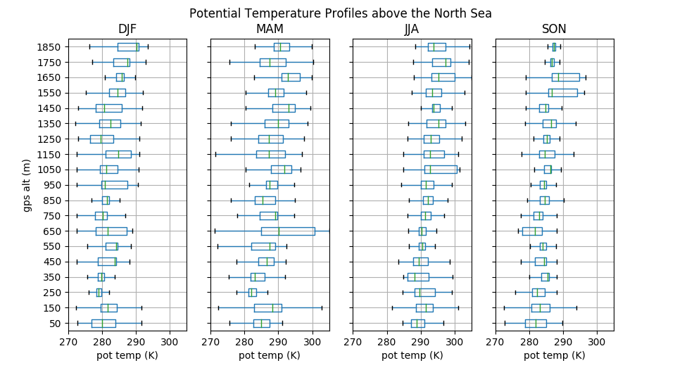

Recipe - Spatial Analysis
=========================

FAAM core data are stored as netCDF and come with *Time* as dimension. However,
since the FAAM aircraft is a moving plaform location is obviously also a
very relevant dimension and spatial queries of the FAAM data can add useful
functionality. To provide this feature the FAAM flight tracks are inserted as
*linestring* into a database with spatial capabilities. Such a database allows
queries like:

  * "Give me all the flights that have crossed Scotland"
  * "On which flights did we fly closer closer than 10nm miles to the Queen's palace"
  * "What length was the flight track of a specific flight"

DB description
--------------

The spatialite DB is stored in one single file, which is very convenient and
does not require the setup of an advanced database, which can come with a lots
of obstacles. In direct comparison spatialite is less powerful but has all the
features that we need. For more information see:

  | https://www.gaia-gis.it/fossil/libspatialite/index
  | http://www.gaia-gis.it/gaia-sins/spatialite-sql-4.4.0.html
  | https://www.gaia-gis.it/gaia-sins/spatialite-tutorial-2.3.1.html
  | http://postgis.net/docs/

The example database currently holds two relevant tables:

1. flight_tracks

  | fid      - Flight id
  | date     - Start date of flight
  | the_geom - Holds the linestring geometry

2. fltsumm_event

  | fid            - Flight id
  | desc           - Description copied from the flight summary
  | start_datetime - Start time of the event
  | end_datetime   - End time of the event
  | the_geom       - Holds the linestring geometry

For the below examples python is our tool of choice, which has all the
necessary modules to interact with the database.

General: Imports and DB connection
----------------------------------

For the examples below to work we need to import some common modules and
connect to the database.

.. literalinclude:: ./../../examples/faampy_spatial_examples.py
   :language: python
   :start-after: Start General
   :end-before: End General

Example 1: Get some general db info
-----------------------------------

Just get some basic information from the database.

.. literalinclude:: ./../../examples/faampy_spatial_examples.py
   :language: python
   :start-after: Start Example 1
   :end-before: End Example 1

Example 2: Find flights that go over the North Sea
--------------------------------------------------

The goal is to find all FAAM flights that go over the North Sea. To do this we
need the boundaries for the North Sea. A shapefile with the Polygon can be
downloaded from the marineregions_ website:

.. _marineregions: http://www.marineregions.org/gazetteer.php?p=details&id=2350

.. literalinclude:: ./../../examples/faampy_spatial_examples.py
   :language: python
   :start-after: Start Example 2
   :end-before: End Example 2

Example 3: Get the length of a flight track
-------------------------------------------

Get the length of a flight track. The database can do this for us
using the *GreatCircleLength* function.

.. literalinclude:: ./../../examples/faampy_spatial_examples.py
   :language: python
   :start-after: Start Example 3
   :end-before: End Example 3

Example 4: Get all flights when the ARA climbed above a certain altitude
------------------------------------------------------------------------

We are trying to find all the flights where we climbed above a certain gps
altitude. For this we loop over all individual flight tracks. The steps are:
1. Get flight track from DB in json format
2. Use the 'coordinates' key from the json and extract the z-coordinate
3. Check if the maximum z-value is greater than the MAX_ALT and store
the fid in the result list if that's the case

.. literalinclude:: ./../../examples/faampy_spatial_examples.py
   :language: python
   :start-after: Start Example 4
   :end-before: End Example 4

Example 5: Get all flights that took off from Cranfield
-------------------------------------------------------

.. literalinclude:: ./../../examples/faampy_spatial_examples.py
   :language: python
   :start-after: Start Example 5
   :end-before: End Example 5

Example 6-1: Find all profiles over the North Sea that go below 2km
-------------------------------------------------------------------

.. literalinclude:: ./../../examples/faampy_spatial_examples.py
   :language: python
   :start-after: Start Example 6-1
   :end-before: End Example 6-1

Example 6-2: Profiles of potential Temperature over the North Sea
-----------------------------------------------------------------

.. literalinclude:: ./../../examples/faampy_spatial_examples.py
   :language: python
   :start-after: Start Example 6-2
   :end-before: End Example 6-2

